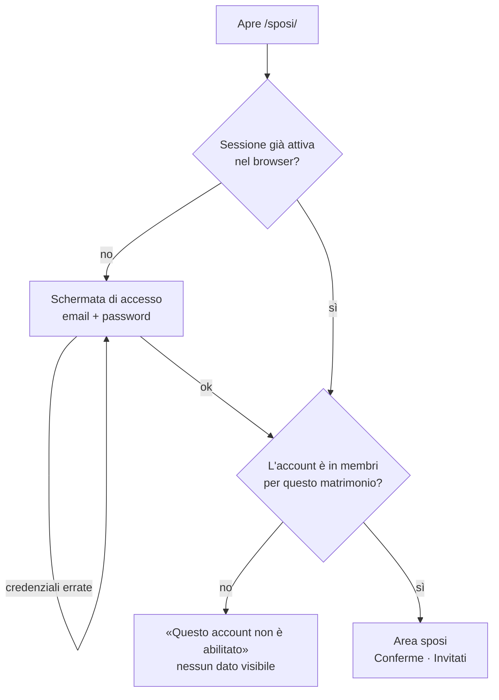

# Login dell'area sposi

Come funziona l'accesso a `/sposi/`, come si gestiscono gli account e cosa protegge i dati.

## In breve

- L'area sposi è la pagina `/sposi/` (online: `https://sangesantonio.github.io/wedding/sposi/`).
- Si entra con **email e password**. Gli account li gestisce **Supabase Auth**: nessun server nostro e nessuna password nel codice.
- Avere un account **non basta**: bisogna anche essere registrati come sposi nella tabella `membri`.
- I permessi non dipendono dal sito ma dal **database**: anche manomettendo la pagina, chi non è in `membri` non legge né modifica niente.
- Nessuno può registrarsi da solo: gli account si creano dalla dashboard di Supabase.

## Il percorso di chi entra



1. **Sessione.** Dopo il login Supabase salva la sessione nel browser (localStorage) e la rinnova da solo: riaprendo la pagina si entra senza rifare il login, finché non si preme *Esci*.
2. **Abilitazione.** Il sito (`useMatrimonio` in [query.ts](../src/sposi/query.ts)) legge la tabella `membri` per sapere quale matrimonio amministra l'account. Se non trova niente mostra "account non abilitato".
3. **Dati.** Ogni lettura e scrittura passa dalle regole RLS del database (vedi sotto), che controllano di nuovo l'appartenenza.

## Password dimenticata

1. In *Password dimenticata?* si inserisce l'email e Supabase manda un link.
2. Il link riporta a `/sposi/`; Supabase segnala l'evento `PASSWORD_RECOVERY` e la pagina mostra *Scegliete una nuova password* (minimo 8 caratteri).
3. Salvata la password, si è dentro.

Perché funzioni, in **Authentication → URL Configuration** l'indirizzo di `/sposi/` deve essere tra i *Redirect URLs*. Se manca, il link porta alla *Site URL* (l'invito) e il cambio password non compare.

L'email di recupero la manda Supabase con il suo servizio predefinito, che ha limiti bassi (poche email l'ora). Per due account basta; con un dominio vostro si può collegare un servizio SMTP in **Authentication → Emails → SMTP Settings**.

## Gestire gli account

### Aggiungere uno sposo (o un'altra persona fidata)

1. Supabase → **Authentication → Users → Add user → Create new user**: email e password, spuntate **Auto Confirm User**.
2. **SQL Editor**:
   ```sql
   insert into membri (matrimonio_id, user_id)
   select m.id, u.id from matrimoni m, auth.users u
   where m.slug = 'antonio-e-rosa' and u.email = 'persona@esempio.it'
   on conflict do nothing;
   ```

Il passo 2 è quello che conta: senza, l'account entra ma vede "non abilitato".

### Togliere l'accesso

```sql
delete from membri
where user_id = (select id from auth.users where email = 'persona@esempio.it');
```

L'accesso ai dati si chiude subito. Per eliminare anche l'account: **Authentication → Users → … → Delete user** (la riga in `membri` si cancella da sola).

### Chi ha accesso adesso

```sql
select u.email, m.slug, b.ruolo, b.creato_il
from membri b
join auth.users u on u.id = b.user_id
join matrimoni m on m.id = b.matrimonio_id;
```

### Cambiare la password di un account

Dall'area sposi: *Esci* → *Password dimenticata?*. Oppure dalla dashboard: **Authentication → Users → … → Send password recovery**.

## Impostazioni Supabase da tenere così

| Dove | Impostazione | Perché |
|---|---|---|
| Authentication → Sign In / Providers | **Allow new users to sign up: disattivato** | Nessuno può crearsi un account dal sito |
| Authentication → Sign In / Providers → Email | Email provider attivo | È il login con password |
| Authentication → URL Configuration | *Site URL* = indirizzo dell'invito; *Redirect URLs* = indirizzo di `/sposi/` (+ `http://localhost:5173/sposi/` per lo sviluppo) | Link di recupero password |

Quando passerete a un dominio vostro, vanno aggiornati questi indirizzi.

## Cosa protegge i dati

Il sito usa solo la chiave **anon**, che è pubblica per definizione (sta nel codice della pagina). La sicurezza sta nelle regole **RLS** del database, definite in [migrazione-03-area-sposi.sql](../supabase/migrazione-03-area-sposi.sql).

La funzione chiave è:

```sql
e_sposo(matrimonio_id)  -- vero solo se l'utente collegato è in membri per quel matrimonio
```

| Tabella | Visitatore (invitato) | Account sposi | Altro account collegato |
|---|---|---|---|
| `prenotazioni` | niente (solo tramite le funzioni `prenota`, `cerca_prenotazione`, `apri_invito`) | legge e modifica il proprio matrimonio | niente |
| `inviti` | niente (solo tramite `apri_invito`) | legge e modifica | niente |
| `storico` | niente | legge | niente |
| `matrimoni` | niente | legge e modifica il proprio | niente |
| `membri` | niente | vede solo le proprie righe | vede solo le proprie righe (nessuna) |
| `posti_occupati` | legge (serve alla sala) | legge | legge |

Conseguenze pratiche:

- Contatti, note e nomi delle prenotazioni non sono leggibili dal sito pubblico.
- Un account creato per errore, o un estraneo che riuscisse a fare login, vede tabelle vuote.
- Le modifiche fatte dall'area sposi finiscono nello `storico` con `chi = 'sposi'` e l'id dell'utente.

Queste regole sono state provate in locale su Postgres simulando invitato, sposo e account estraneo.

## Dove sta il codice

| File | Cosa fa |
|---|---|
| [sposi/index.html](../sposi/index.html) | Pagina dell'area sposi (con `noindex`, non compare sui motori di ricerca) |
| [src/sposi/Accesso.tsx](../src/sposi/Accesso.tsx) | Login, password dimenticata, nuova password, logout |
| [src/sposi/main.tsx](../src/sposi/main.tsx) | Controlla l'abilitazione e monta le pagine Panoramica, Ospiti, Impostazioni |
| [src/sposi/dati.ts](../src/sposi/dati.ts) | `caricaMatrimonio()`: legge `membri` per sapere quale matrimonio si amministra |
| [src/lib/supabase.ts](../src/lib/supabase.ts) | Client Supabase condiviso con l'invito |
| [supabase/migrazione-03-area-sposi.sql](../supabase/migrazione-03-area-sposi.sql) | Tabelle `membri`, funzione `e_sposo`, regole RLS |

## Prove in locale

- `npm run dev` → http://localhost:5173/sposi/ usa il database vero (file `.env`): serve un account abilitato.
- `npm run demo` → http://localhost:5174/sposi/ entra **senza login** con dati finti: utile per provare l'interfaccia senza toccare il database.

## Problemi comuni

| Sintomo | Causa probabile | Soluzione |
|---|---|---|
| "Email o password non corrette" | Password sbagliata, o account creato senza *Auto Confirm* | Recupero password; oppure **Authentication → Users** → confermate l'utente |
| "Questo account non è abilitato" | Manca la riga in `membri` | Eseguite l'`insert into membri` sopra |
| Il link di recupero apre l'invito invece di `/sposi/` | `/sposi/` non è tra i *Redirect URLs* | Aggiungetelo in **URL Configuration** |
| L'email di recupero non arriva | Limite del servizio email predefinito, o spam | Controllate lo spam e riprovate dopo un'ora; oppure **Send password recovery** dalla dashboard |
| Entrate ma le liste sono vuote | Account in `membri` di un altro matrimonio, o dati davvero vuoti | Controllate con la query "Chi ha accesso adesso" |

## In futuro

- **Accedi con Google**: si aggiunge il provider Google in Supabase (serve un client OAuth dalla Google Cloud Console). Funzionerà insieme alla password: con la stessa email si entra nello stesso account, e chi non è in `membri` continuerà a non vedere niente.
- **Più ruoli** (testimoni, wedding planner): la colonna `membri.ruolo` è già prevista.
- **Piattaforma per altri sposi**: ogni coppia avrà le sue righe in `matrimoni` e `membri`; le regole RLS valgono già per più matrimoni.
