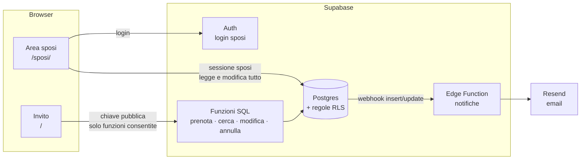

# Piano di lavoro

Documento vivo: si spunta man mano. Ogni fase si chiude con una prova vera e una pubblicazione.

## Stato attuale

- [x] Invito: busta, sala 3D/elenco, nome e note, biglietto, IBAN
- [x] Conferme salvate su Supabase, codice `AR-XXXXXX`, ricerca per codice
- [x] Posti scenografici: almeno 12 sedie sempre libere
- [x] Email agli sposi a ogni conferma (Resend)
- [x] Mappa "Come arrivare" e file calendario
- [x] La prenotazione ricordata dal browser viene ricontrollata sul database

---

## Architettura

Nessun server da gestire. Il sito resta statico (GitHub Pages, poi il vostro dominio).
Il "backend" è Supabase: database, permessi, login, funzioni ed email.



### Scelte

| Tema | Scelta | Perché |
|---|---|---|
| Area sposi | Seconda pagina dello stesso progetto (`/sposi/`), con un bundle separato | Gli invitati non scaricano il codice dell'area sposi; un solo repo e una sola pubblicazione |
| Login | Supabase Auth: **email + password** e **Accedi con Google**. Account creati da voi (invito dalla dashboard), iscrizioni pubbliche disattivate | Google entra solo se l'email è già un account; chi non è in `membri` non vede niente |
| Permessi | Tabella `membri` (chi amministra quale matrimonio) + regole RLS | Il database rifiuta qualunque lettura non autorizzata, anche se qualcuno manomette il sito |
| Invitati | Nessun login. **Link personale** per famiglia (`?i=TOKEN`, 8 caratteri) come chiave principale; il **codice** `AR-XXXXXX` resta per il link generico | Zero attrito per i parenti; un link inoltrato espone solo quella famiglia |
| Excel | Modello scaricabile + import `.xlsx`/`.csv` con SheetJS, caricato solo nell'area sposi | Gli invitati di solito stanno già in un foglio |
| WhatsApp | Link `wa.me/39…?text=…` con messaggio pronto + modalità **"Invia in sequenza"**; senza telefono: Copia link / Condividi | L'invio automatico (WhatsApp Business API) è a pagamento e richiede approvazione Meta: non vale la pena |
| Link generico | Resta attivo come riserva: le conferme arrivano con stato **da verificare** | Niente si blocca se mandate l'invito al volo; gli estranei non finiscono tra i confermati |
| Pronto per la piattaforma | Da subito una tabella `matrimoni` e `matrimonio_id` su ogni riga | Aggiungerlo dopo costa molto; adesso costa una colonna. Per ora esiste un solo matrimonio |
| Impostazioni | `matrimoni.config` (JSON) letto dal sito, con i valori attuali di `config.ts` come riserva | Si modificano dall'area sposi senza ripubblicare; è la base dei futuri template |
| Dominio | Non serve per partire. Dopo: dominio su GitHub Pages (o Cloudflare Pages/Netlify) + aggiornare gli URL in Supabase Auth | Il dominio vostro permette anche di mandare email agli invitati (Resend con dominio verificato) |

### Modello dati (obiettivo)

```text
matrimoni      id · slug · config(jsonb) · creato_il
membri         matrimonio_id · user_id · ruolo('sposi')
inviti         id · matrimonio_id · token · nome('Famiglia Esposito') · telefono · email · persone_previste(indicativo)
               nota_sposi · inviato_il · aperto_il · revocato · creato_il
prenotazioni   id · matrimonio_id · invito_id(nullable) · codice · nome · contatto · note · persone · posti[] · supplementi[] · totale
               stato('confermata' | 'da_verificare' | 'annullata')
               richiamo('da_sentire' | 'confermato' | 'non_viene' | 'non_risponde')   ← seconda conferma
               richiamo_il · nota_sposi · creata_il · modificata_il
posti_occupati posto · prenotazione_id · matrimonio_id · nome · creata_il       (solo prenotazioni confermate)
storico        id · prenotazione_id · chi('invitato' | 'sposi') · cosa · prima(jsonb) · dopo(jsonb) · quando
```

---

## Fasi

### Fase 1 — Fondamenta del database
Migrazione [`03`](../supabase/migrazione-03-area-sposi.sql), invisibile agli invitati. Provata in locale su Postgres (PGlite).

- [ ] Tabelle `matrimoni`, `membri` e `inviti`; `matrimonio_id` su prenotazioni e posti (riempito con l'unico matrimonio)
- [ ] Colonne `stato`, `richiamo`, `richiamo_il`, `nota_sposi`, `modificata_il`; tabella `storico`
- [ ] Funzione `e_sposo(matrimonio_id)` e regole RLS: i membri leggono e modificano solo il proprio matrimonio
- [ ] Le funzioni `prenota` e `cerca_prenotazione` restano compatibili (il sito attuale continua a funzionare)
- [ ] Le prenotazioni annullate non occupano sedie e non compaiono nel conteggio
- [ ] Data del matrimonio e `giorni_blocco_modifiche = 10` in `matrimoni.config`, usati dalle funzioni SQL

### Fase 2 — Area sposi: login ed elenco
- [ ] Pagina `/sposi/` con login (email + password) e logout; password dimenticata
- [ ] "Accedi con Google" (client OAuth nella Google Cloud Console + provider in Supabase)
- [ ] Account vostri creati dalla dashboard; iscrizioni pubbliche disattivate
- [ ] Riepilogo in alto: famiglie, persone confermate, annullate, da risentire
- [ ] Elenco con ricerca e filtri (stato, richiamo); a ogni riga nome, persone, posti, contatto, note, codice, data
- [ ] Contatto cliccabile: chiama, WhatsApp (`wa.me`), email
- [ ] Esporta CSV (per catering, tableau, segnaposti)
- [ ] Aggiornamento in tempo reale quando arriva una conferma

### Fase 2b — Lista invitati e link personali
*Da fare prima di mandare l'invito.*
- [ ] Lista invitati nell'area sposi: famiglia, telefono, email, persone previste, nota; inserimento e modifica a mano
- [ ] **Scarica modello Excel** e **Carica Excel/CSV**: anteprima prima di importare, righe con errori evidenziate, niente doppioni
- [ ] Numeri di telefono normalizzati (`333 123 4567` → `+39 333 1234567`)
- [ ] Link personale per ogni invito: **Copia link**, **WhatsApp** (se c'è il telefono, messaggio già scritto), **Condividi** (menu del telefono)
- [ ] Modalità **"Invia in sequenza"**: un tocco per famiglia, segna automaticamente "inviato"
- [ ] Stato per invito: non aperto · aperto · confermato · annullato → "chi non ha ancora risposto"
- [ ] L'invito riconosce `?i=TOKEN`: saluta la famiglia, propone le persone previste, collega la prenotazione all'invito
- [ ] Link generico: le conferme entrano come **da verificare**; nell'area sposi le approvate o le collegate a un invito
- [ ] Token sconosciuto o revocato → messaggio gentile "questo invito non è più valido, scriveteci"

### Fase 3 — Seconda conferma e gestione dagli sposi
- [ ] Su ogni riga: stato del richiamo con un tocco (confermato / non viene / non risponde) + data automatica
- [ ] Nota privata degli sposi ("richiamare dopo il 20", "porta la torta")
- [ ] Modifica di una prenotazione: nome, persone, posti, contatto, note
- [ ] Annulla / ripristina
- [ ] Aggiungi prenotazione a mano (chi conferma per telefono) con codice generato
- [ ] Ogni modifica finisce nello `storico`

### Fase 4 — Gli invitati gestiscono la propria prenotazione
- [ ] Dal biglietto (con codice o dal browser che la ricorda): **Modifica** e **Annulla presenza**
- [ ] Modifiche possibili: aggiungere o togliere persone, cambiare sedie, contatto e note
- [ ] Annullare non cancella: stato `annullata`, ripristinabile dagli sposi
- [ ] Modifiche fino a **10 giorni prima**, controllate dal database; dopo si vede "per modifiche scriveteci" e modificano solo gli sposi
- [ ] Funzioni SQL `modifica_prenotazione(codice, …)` e `annulla_prenotazione(codice)`, con controlli lato database
- [ ] Email agli sposi anche su modifica e annullamento ("Famiglia Esposito: da 4 a 3 persone")
- [ ] Con il link personale non serve il codice; il codice `AR-XXXXXX` resta per chi ha confermato dal link generico

### Fase 5 — Impostazioni modificabili
- [ ] `matrimoni.config` con lo stesso formato di `config.ts` + `sala.ts`, validato
- [ ] L'invito legge le impostazioni dal database (con le attuali come riserva se il database non risponde)
- [ ] Editor nell'area sposi, a sezioni: sposi e date · luogo (con ricerca sulla mappa) · IBAN · testi · settori e prezzi · supplementi · posti sempre liberi · scadenza modifiche
- [ ] Anteprima dell'invito prima di salvare
- [ ] Tavoli e disposizione della sala: per ora restano nel codice *(editor visuale = progetto a sé)*

### Fase 6 — Rifiniture e lancio
- [ ] Immagine di anteprima per WhatsApp
- [ ] IBAN vero
- [ ] Dominio vostro + HTTPS + URL aggiornati in Supabase Auth
- [ ] *(facoltativo)* Email di conferma all'invitato con il codice (richiede dominio verificato su Resend)
- [ ] Prova completa da 2–3 telefoni diversi

### Dopo il matrimonio — verso la piattaforma
- Pulsante "confermo di nuovo" per gli invitati (seconda conferma in autonomia)
- Registrazione sposi in autonomia, un `slug` per matrimonio (`/antonio-e-rosa`)
- Template grafici (il `config` diventa per template)
- Editor della sala e dei tavoli
- Ruoli aggiuntivi (testimoni, wedding planner) tramite `membri.ruolo`
- Piani a pagamento, limiti, privacy policy e GDPR (i dati degli invitati sono dati personali)

---

## Decisioni prese

| Tema | Decisione |
|---|---|
| Login sposi | Email + password, più "Accedi con Google" |
| Invitati aggiungono persone | Sì, liberamente (massimo tecnico 12). Il numero nel file è **indicativo**: nell'area sposi compare "+2 rispetto al previsto" |
| Scadenza modifiche invitati | **10 giorni prima** del matrimonio; dopo, modificano solo gli sposi |
| Annullamento | Non cancella: la prenotazione resta con stato `annullata` e si può ripristinare |
| Seconda conferma | La segnano gli sposi dopo la telefonata. Pulsante "confermo di nuovo" per gli invitati: dopo, non prioritario |
| Link inoltrati | Link personali per famiglia + link generico con stato "da verificare" |
| Lista invitati | Inserimento a mano **e** caricamento Excel da un modello scaricabile (famiglia, telefono, email, persone previste, note) |
| Invio inviti | Con telefono: WhatsApp con messaggio pronto e invio in sequenza. Sempre: copia link manuale |

## Domande aperte

1. Chi apre un link personale vede il **nome della famiglia** già scritto ("Ciao Famiglia Esposito")? *(proposta: sì)*
2. Testo del messaggio WhatsApp: lo scriviamo insieme in Fase 2b (modificabile dall'area sposi).
