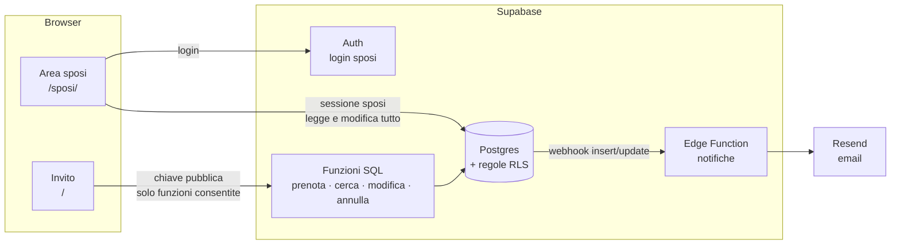

# Piano di lavoro

Documento vivo: si spunta man mano. Ogni fase si chiude con una prova vera e una pubblicazione.

## Stato attuale

- [x] Invito: busta, sala 3D/elenco, nome e note, biglietto, IBAN
- [x] Conferme salvate su Supabase, codice `AR-XXXXXX`, ricerca per codice
- [x] Posti scenografici: almeno 12 sedie sempre libere
- [x] Email agli sposi a ogni conferma (Resend)
- [x] Mappa "Come arrivare" e file calendario
- [x] La prenotazione ricordata dal browser viene ricontrollata sul database

---

## Architettura

Nessun server da gestire. Il sito resta statico (GitHub Pages, poi il vostro dominio).
Il "backend" è Supabase: database, permessi, login, funzioni ed email.



### Scelte

| Tema | Scelta | Perché |
|---|---|---|
| Area sposi | Seconda pagina dello stesso progetto (`/sposi/`), con un bundle separato | Gli invitati non scaricano il codice dell'area sposi; un solo repo e una sola pubblicazione |
| Login | Supabase Auth: **email + password** e **Accedi con Google**. Account creati da voi (invito dalla dashboard), iscrizioni pubbliche disattivate | Google entra solo se l'email è già un account; chi non è in `membri` non vede niente |
| Permessi | Tabella `membri` (chi amministra quale matrimonio) + regole RLS | Il database rifiuta qualunque lettura non autorizzata, anche se qualcuno manomette il sito |
| Invitati | Nessun login. **Link personale** per famiglia (`?i=TOKEN`, 8 caratteri) come chiave principale; il **codice** `AR-XXXXXX` resta per il link generico | Zero attrito per i parenti; un link inoltrato espone solo quella famiglia |
| Excel | Modello scaricabile + import `.xlsx`/`.csv` con SheetJS, caricato solo nell'area sposi | Gli invitati di solito stanno già in un foglio |
| WhatsApp | Link `wa.me/39…?text=…` con messaggio pronto + modalità **"Invia in sequenza"**; senza telefono: Copia link / Condividi | L'invio automatico (WhatsApp Business API) è a pagamento e richiede approvazione Meta: non vale la pena |
| Link generico | Resta attivo come riserva: le conferme arrivano con stato **da verificare** | Niente si blocca se mandate l'invito al volo; gli estranei non finiscono tra i confermati |
| Pronto per la piattaforma | Da subito una tabella `matrimoni` e `matrimonio_id` su ogni riga | Aggiungerlo dopo costa molto; adesso costa una colonna. Per ora esiste un solo matrimonio |
| Impostazioni | `matrimoni.config` (JSON) letto dal sito, con i valori attuali di `config.ts` come riserva | Si modificano dall'area sposi senza ripubblicare; è la base dei futuri template |
| Dominio | Non serve per partire. Dopo: dominio su GitHub Pages (o Cloudflare Pages/Netlify) + aggiornare gli URL in Supabase Auth | Il dominio vostro permette anche di mandare email agli invitati (Resend con dominio verificato) |

### Modello dati (obiettivo)

```text
matrimoni      id · slug · config(jsonb) · creato_il
membri         matrimonio_id · user_id · ruolo('sposi')
inviti         id · matrimonio_id · token · nome('Famiglia Esposito') · telefono · email · persone_previste(indicativo)
               nota_sposi · inviato_il · aperto_il · revocato · creato_il
prenotazioni   id · matrimonio_id · invito_id(nullable) · codice · nome · contatto · note · persone · posti[] · supplementi[] · totale
               stato('confermata' | 'da_verificare' | 'annullata')
               richiamo('da_sentire' | 'confermato' | 'non_viene' | 'non_risponde')   ← seconda conferma
               richiamo_il · nota_sposi · creata_il · modificata_il
posti_occupati posto · prenotazione_id · matrimonio_id · nome · creata_il       (solo prenotazioni confermate)
storico        id · prenotazione_id · chi('invitato' | 'sposi') · cosa · prima(jsonb) · dopo(jsonb) · quando
```

---

## Fasi

### Fase 1 — Fondamenta del database ✅
Migrazione [`03`](../supabase/migrazione-03-area-sposi.sql), invisibile agli invitati. Provata in locale su Postgres (PGlite).

- [x] Tabelle `matrimoni`, `membri` e `inviti`; `matrimonio_id` su prenotazioni e posti (riempito con l'unico matrimonio)
- [x] Colonne `stato`, `richiamo`, `richiamo_il`, `nota_sposi`, `modificata_il`; tabella `storico`
- [x] Funzione `e_sposo(matrimonio_id)` e regole RLS: i membri leggono e modificano solo il proprio matrimonio
- [x] Le funzioni `prenota` e `cerca_prenotazione` restano compatibili (il sito attuale continua a funzionare)
- [x] Le prenotazioni annullate non occupano sedie e non compaiono nel conteggio
- [x] Data del matrimonio e `giorni_blocco_modifiche = 10` in `matrimoni.config`, usati dalle funzioni SQL

### Fase 2 — Area sposi: login ed elenco ✅ *(Google rimandato)*
- [x] Pagina `/sposi/` con login (email + password) e logout; password dimenticata
- [ ] *(rimandato)* "Accedi con Google" (client OAuth nella Google Cloud Console + provider in Supabase)
- [x] Account vostri creati dalla dashboard; iscrizioni pubbliche disattivate
- [x] Riepilogo in alto: famiglie, persone confermate, annullate, da risentire
- [x] Elenco con ricerca e filtri (stato, richiamo); a ogni riga nome, persone, posti, contatto, note, codice, data
- [x] Contatto cliccabile: chiama, WhatsApp (`wa.me`), email
- [x] Esporta CSV (per catering, tableau, segnaposti)
- [x] Aggiornamento in tempo reale quando arriva una conferma

### Fase 2b — Lista invitati e link personali ✅
*Da fare prima di mandare l'invito.*
- [x] Lista invitati nell'area sposi: famiglia, telefono, email, persone previste, nota; inserimento e modifica a mano
- [x] **Scarica modello Excel** e **Carica Excel/CSV**: anteprima prima di importare, righe con errori evidenziate, niente doppioni
- [x] Numeri di telefono normalizzati (`333 123 4567` → `+39 333 1234567`)
- [x] Link personale per ogni invito: **Copia link**, **WhatsApp** (se c'è il telefono, messaggio già scritto), **Condividi** (menu del telefono)
- [x] Modalità **"Invia in sequenza"**: un tocco per famiglia, segna automaticamente "inviato"
- [x] Stato per invito: non aperto · aperto · confermato · annullato → "chi non ha ancora risposto"
- [x] L'invito riconosce `?i=TOKEN`: saluta la famiglia, propone le persone previste, collega la prenotazione all'invito
- [x] Link generico: le conferme entrano come **da verificare**; nell'area sposi le approvate o le collegate a un invito
- [x] Token sconosciuto o revocato → messaggio gentile "questo invito non è più valido, scriveteci"

> **Da qui l'ordine cambia.** Le funzioni ci sono quasi tutte; il limite ora è l'interfaccia dell'area sposi
> (schede troppo grandi per 50 famiglie e 100+ persone, aspetto poco professionale). Prima si rifà la base grafica
> e la tabella, poi le funzioni mancanti si costruiscono direttamente sulla base nuova, senza rifarle due volte.

### Nominativi degli ospiti ✅
- [x] Un nome per ogni posto (e "bimbo"), nell'invito, nel biglietto, nell'email e nell'area sposi — [migrazione 06](../supabase/migrazione-06-ospiti.sql)
- [x] Esportazione Excel: foglio **Ospiti** (una riga per persona, divisa per famiglia) + foglio **Famiglie**

### Fase A — Nuova base dell'area sposi ✅
Solo `/sposi/`: l'invito per gli ospiti mantiene il suo stile, che è già curato.
- [x] Stack (vedi *Frontend dell'area sposi* sotto): Tailwind CSS 4 + componenti **shadcn/ui** (Radix), solo nel bundle `/sposi/`
- [x] Temi: colori dell'invito (avorio, salvia, bosco, oro) come variabili; chiaro e scuro; Cormorant per i titoli, Inter per l'interfaccia
- [x] Struttura: barra laterale su computer, barra in basso su telefono; pagine **Panoramica · Ospiti · Impostazioni**
- [x] Componenti base: pulsanti, campi, badge di stato, menu, finestre, pannello laterale (computer) / foglio dal basso (telefono), notifiche
- [x] Ricerca rapida `Ctrl+K` / tocco sulla lente: trova una famiglia da qualunque pagina
- [x] Installabile come app (PWA): icona sulla schermata del telefono, apertura a tutto schermo
- [x] Le funzioni di oggi (login, inviti, Excel, WhatsApp, verifica) portate sulla base nuova senza perderne nessuna

### Fase B — Tabella "Ospiti" compatta ✅
Una riga per famiglia (~44 px su computer), al posto di schede separate per inviti e conferme.
- [x] **Una sola vista**: invito + prenotazione sulla stessa riga; le conferme dal link generico compaiono come righe "da verificare"
- [x] Colonne: famiglia · stato (inviato / aperto / confermato / annullato / da verificare) · persone (previste → confermate) · telefono · seconda conferma · note · ultimo aggiornamento
- [x] Ordinamento per colonna, filtri rapidi a "pillole" con i conteggi, ricerca, colonne da mostrare/nascondere, densità comoda/compatta
- [x] Selezione multipla con azioni di gruppo: invia in sequenza solo ai selezionati, segna inviato, revoca, esporta
- [x] Clic su una riga → pannello di dettaglio (dati, prenotazione, posti, storico, azioni) senza lasciare la tabella
- [x] Su telefono: righe compatte a due linee (nome + stato, persone + telefono), tocco → foglio dal basso
- [x] Intestazione fissa · *(virtualizzazione non necessaria: 50–100 famiglie scorrono senza problemi)*
- [x] **Panoramica**: numeri principali, risposte nel tempo (grafico), lista "da fare" (da verificare, senza risposta da 7 giorni, da risentire)

### Fase C — Gestione completa dagli sposi *(ex Fase 3)* ✅
Tutto dentro il pannello di dettaglio della tabella.
- [x] Seconda conferma con un tocco (riconfermato / non viene / non risponde) + data automatica
- [x] Nota privata degli sposi
- [x] Modifica prenotazione: nome, persone, posti, contatto, note; annulla / ripristina
- [x] Aggiungi prenotazione a mano (chi conferma per telefono)
- [x] Storico leggibile come linea del tempo ("3 ott · Famiglia Esposito ha confermato 4 persone", "5 ott · Voi: riconfermato")

### Fase D — Gli invitati modificano la propria prenotazione *(ex Fase 4)*
- [ ] Dal biglietto (link personale o codice): **Modifica** (persone, sedie, contatto, note) e **Annulla presenza**
- [ ] Fino a **10 giorni prima**, controllato dal database; poi "per modifiche scriveteci" e modificano solo gli sposi
- [ ] Funzioni SQL `modifica_prenotazione` e `annulla_prenotazione`, con storico automatico
- [ ] Email agli sposi su modifica e annullamento ("Famiglia Esposito: da 4 a 3 persone")

### Fase E — Personalizzazione del matrimonio *(ex Fase 5)*
- [ ] `matrimoni.config` validato con uno schema; l'invito lo legge dal database (con `config.ts` come riserva)
- [ ] Pagina **Impostazioni** a sezioni: sposi e data · luogo (ricerca sulla mappa) · IBAN · testi dell'invito · messaggio WhatsApp · settori, prezzi e supplementi · posti sempre liberi · scadenza modifiche
- [ ] Moduli con validazione e salvataggio sicuro; **anteprima dal vivo** dell'invito accanto al modulo
- [ ] Tavoli e disposizione della sala: restano nel codice *(editor visuale = progetto a sé)*

### Fase F — Rifiniture e lancio *(ex Fase 6)*
- [ ] Immagine di anteprima per WhatsApp · IBAN vero · dominio vostro (+ URL in Supabase Auth)
- [ ] Test automatici dei percorsi principali (Playwright): conferma da link personale, link generico, login sposi, import Excel
- [ ] *(facoltativo)* Email di conferma all'invitato con il codice (serve un dominio verificato su Resend)
- [ ] Prova completa da 2–3 telefoni diversi

---

## Frontend dell'area sposi

| Tema | Scelta | Perché |
|---|---|---|
| Stile | **Tailwind CSS 4**, caricato solo in `/sposi/` | Veloce da mantenere, coerente; non tocca l'invito degli ospiti |
| Componenti | **shadcn/ui** (su Radix UI): Button, Input, Select, Dialog, Sheet, DropdownMenu, Tabs, Tooltip, Badge, Command… | Aspetto moderno e sobrio, accessibili da tastiera e lettori di schermo; il codice dei componenti entra nel progetto e si adatta ai nostri colori |
| Tabella | **TanStack Table** (+ TanStack Virtual se servono molte righe) | Ordinamento, filtri, selezione, colonne configurabili; nessun aspetto imposto |
| Foglio dal basso su telefono | **Vaul** | Gesto naturale da app, si chiude trascinando |
| Notifiche | **Sonner** | Messaggi brevi ("Invito copiato") con annulla |
| Ricerca rapida | **cmdk** | `Ctrl+K` su computer, lente su telefono |
| Moduli | **React Hook Form + Zod** | Validazione chiara, stessa regola usata per salvare le impostazioni |
| Navigazione | **React Router** (pagine `/sposi/#/ospiti`, `#/impostazioni`) | Link diretti alle pagine; funziona su GitHub Pages senza configurazioni |
| Grafici | **Recharts** (solo Panoramica) | Leggero quanto basta per due grafici |
| Icone | **Lucide** (già in uso) | Coerenti con l'invito |
| App sul telefono | **PWA** subito; **Capacitor** in futuro per App Store/Play Store con lo stesso codice | Nessuna riscrittura in React Native |

Alternativa valutata: **Mantine** (libreria completa, più pronta all'uso ma più pesante e meno personalizzabile). MUI e Ant Design sono scartati: aspetto da gestionale.

### Linee guida
- **Telefono prima**: ogni azione si fa con un pollice; obiettivi di tocco ≥ 44 px; niente tabelle larghe su schermi stretti.
- **Densità**: su computer una famiglia per riga, almeno 15 righe visibili senza scorrere.
- **Una sola fonte di dati**: le pagine leggono da un unico archivio (TanStack Query) che si aggiorna in tempo reale.
- **Prestazioni**: `/sposi/` resta separato dall'invito; le parti pesanti (Excel, grafici) si caricano solo quando servono.

### Dopo il matrimonio — verso la piattaforma
- Pulsante "confermo di nuovo" per gli invitati (seconda conferma in autonomia)
- Registrazione sposi in autonomia, un `slug` per matrimonio (`/antonio-e-rosa`)
- Template grafici (il `config` diventa per template)
- Editor della sala e dei tavoli
- Ruoli aggiuntivi (testimoni, wedding planner) tramite `membri.ruolo`
- Piani a pagamento, limiti, privacy policy e GDPR (i dati degli invitati sono dati personali)

---

## Decisioni prese

| Tema | Decisione |
|---|---|
| Login sposi | Email + password; "Accedi con Google" più avanti |
| Area sposi | Vista tabellare compatta e base grafica nuova **prima** delle funzioni mancanti |
| Invitati aggiungono persone | Sì, liberamente (massimo tecnico 12). Il numero nel file è **indicativo**: nell'area sposi compare "+2 rispetto al previsto" |
| Scadenza modifiche invitati | **10 giorni prima** del matrimonio; dopo, modificano solo gli sposi |
| Annullamento | Non cancella: la prenotazione resta con stato `annullata` e si può ripristinare |
| Seconda conferma | La segnano gli sposi dopo la telefonata. Pulsante "confermo di nuovo" per gli invitati: dopo, non prioritario |
| Link inoltrati | Link personali per famiglia + link generico con stato "da verificare" |
| Lista invitati | Inserimento a mano **e** caricamento Excel da un modello scaricabile (famiglia, telefono, email, persone previste, note) |
| Invio inviti | Con telefono: WhatsApp con messaggio pronto e invio in sequenza. Sempre: copia link manuale |
| Data | Martedì 20 luglio 2027, ore 17:00 |
| Saluto personale | Chi apre il suo link vede "per Famiglia Esposito" sulla busta e "Ciao Famiglia Esposito" come titolo |

## Domande aperte

Nessuna al momento.
